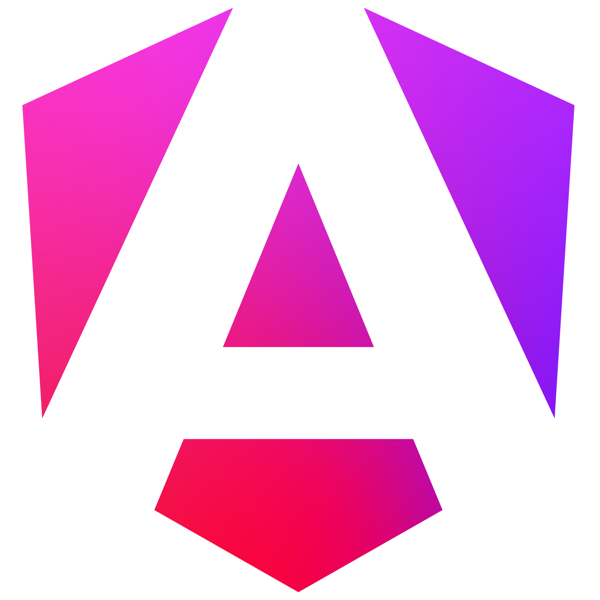

# Advent of Code 2025 
 

[](https://github.com/Meisterlala/advent-of-code-2025/commits/main/)

You can view my solution online!
- Simply open [my Website](https://adventofcode2025.meisterlala.dev) 
- or open the [GitHub Pages version](https://meisterlala.github.io/advent-of-code-2025/)

## What is Advent of Code? 🎄

[Advent of Code](https://adventofcode.com/) is an Advent calendar of small programming puzzles for a variety of skill sets and skill levels that can be solved in any programming language you like. Each day there will be a new problem that is split into 2 parts. The second parts is a more difficult variation of the first part. This repository contains my solutions to the Advent of Code 2025 puzzles

## How did i solve the puzzles?

This Year i decided try out WebAssembly. I wrote a frontend website in Angular, where you can more easily run the code and get the solutions. But all the actual algorithms and logic are implemented in Rust and compiled. This allows me to write high-performance code in Rust, while still being able to use the powerful features of Angular for the user interface.

### Some of the techniques used in the solutions

### How to run the code?

#### Angular + Rust WebAssembly

You can start the Angular frontend and run the solutions in WebAssembly. For this its easiest to use the build in angular server. But we also need to compile the Rust code to produce the WebAssembly modules. To do this you'll need to have [pnpm](https://pnpm.io/) and [Rust](https://www.rust-lang.org/tools/install) installed on your system. (npm will probably also work)

```sh
cd frontend
# Install dependencies
pnpm install
# Allow build scripts to run
pnpm approve-builds
# Build the Rust code to WebAssembly
pnpm build
# Start the angular server
pnpm start
```

This will start a local web server, usually at `http://localhost:4200`, where you can access the frontend and run the solutions. You will need to obtain the puzzle inputs from the [Advent of Code](https://adventofcode.com/2025) website.

#### Rust standalone

You can run the Rust code standalone without the Angular frontend. This produces a binary that runs the solutions in the terminal. To run the code, you'll first need to obtain the puzzle inputs from the [Advent of Code](https://adventofcode.com/2025) website and place them in the [input folder](inputs). Or save your session cookie in the environment variable `AOC_SESSION`.

You'll also need to have Rust installed on your system. If you haven't installed it yet, you can download it from [here](https://www.rust-lang.org/tools/install). Once you have Rust installed and the inputs in place, you can run all the puzzles using the following command:

```sh
cd rust-wasm
# Run all the days
cargo run --release
# Run a specific days
cargo run --release -- day01
```

#### How to benchmark the code?

You can benchmark the performance of the code using the following commands:

```sh
cd rust-wasm
# Benchmark all the days
cargo bench
# Benchmark a specific days
cargo bench -- day01
```
